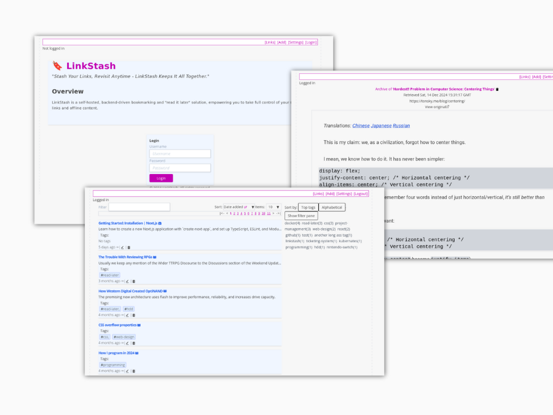

# :bookmark: LinkStash

**"Stash Your Links, Revisit Anytime - LinkStash: Your Self-Hosted Bookmark Manager"**

LinkStash is a self-hosted, backend-driven bookmarking and "read it later" solution, empowering you to take full control of your saved links and offline content.



## Features

- **:file_folder: Privacy & Ownership**: Full control over your data, self-hosted for maximum privacy.
- **:globe_with_meridians: Offline Access**: Save and read content offline, even without internet.
- **:file_cabinet: Simple Deployment**: Get started quickly with Docker Compose.
- **:wrench: REST API Integration**: Easily connect and automate with full REST API support.
## Why LinkStash?

LinkStash is designed to give you complete control over your bookmarking needs. Unlike cloud-based alternatives, LinkStash offers:
- **Privacy & Ownership**: Self-hosted, so your data stays with you.
- **Offline Reading**: Save articles for later, even when you're offline.
- **REST API Access**: Full access to all features via REST endpoints, making it easy to integrate with other tools.
- **Easy Deployment**: Get started quickly with Docker Compose, making setup painless.

LinkStash is built for users who value control, privacy, and flexibility in organizing their web content.
## Quickstart

### Docker Compose

To get up and running with default settings using Docker Compose:

```bash
mkdir config
mkdir archive

wget https://raw.githubusercontent.com/ahmadfarhan1981/linkstash/develop/docker/docker-compose.yaml

docker compose up -d
```

Access LinkStash at: [http://localhost:3000](http://localhost:3000)

**Default credentials:**
```plaintext
username: admin
password: password
```

## Persistent Data
Persistent data created by LinkStash is located in two places:
- MySQL data files are stored in the `linkstash-data` Docker volume.
- The `./archive` folder contains downloaded assets for offline use.

## More info 
Visit the [website](http://linkstashapp.com) for the user guide

## Community, Contribution & Development

Thanks for taking the time to contribute!

All types of contributions are encouraged and valued. 🎉

If you like the project, but just don't have time to contribute, that's fine. You can support the project by:
- Star the project
- Mention the project on social media
- Participate in in [discussions](https://github.com/ahmadfarhan1981/linkstash/discussions).
 
For detailed contribution guidelines, see [CONTRIBUTING.md](CONTRIBUTING.md).

## Similar Projects / Services

- [Linkding](https://github.com/sissbruecker/linkding/)
- [Pinboard](https://pinboard.in)
- Delicious (now defunct): 

## Status

### MVP release

**MVP feature set:**
- :white_check_mark: Bookmarking
- :white_check_mark: Tagging / filtering
- :white_check_mark: Archiving
- :white_check_mark: Docker deployment
- :white_check_mark: Import

The project is still in progress. 


### For the Future

*These plans may evolve based on feedback.*

Post-MVP, the focus areas will include:
- **Management Features**
  - Semantic search
  - Grouping by domains
  - Link duplication checks
  - Change detection / link rot checking
  - Statistics
- **UI Improvements**
  - Responsive mobile layout
  - General UX enhancements
- **Integrations**
  - Integration with services like paperless-ngx, archivebox, and internet archive
- **Archiving Improvements**
  - Support for various formats
  - Archive versioning

