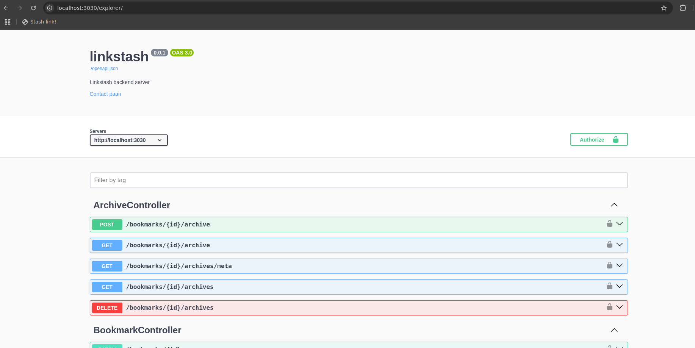

# 02 LinkStash API Reference

This document serves as a reference for the LinkStash backend API.

## OpenAPI Specification
The backend APIs are self-documented via OpenAPI specifications. Access the OpenAPI JSON file at:

`http://localhost:3030/openapi.json`

## API Explorer
Loopback generates an **interactive API Explorer** to explore and test the API. Access it at:

`http://localhost:3030/explorer`

> **Note:** `http://localhost:3030` is the default backend URL. Use your custom backend URL if it's different.

## Getting Help
The API Explorer is designed to be intuitive and self-explanatory. However, if you encounter any issues or have questions:
- [Raise an issue](https://github.com/ahmadfarhan1981/linkstash/issues)
- [Open a discussion](https://github.com/ahmadfarhan1981/linkstash/discussions)

>  