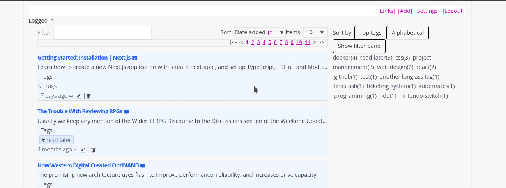
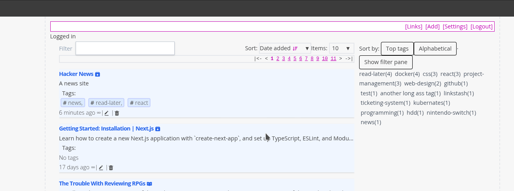
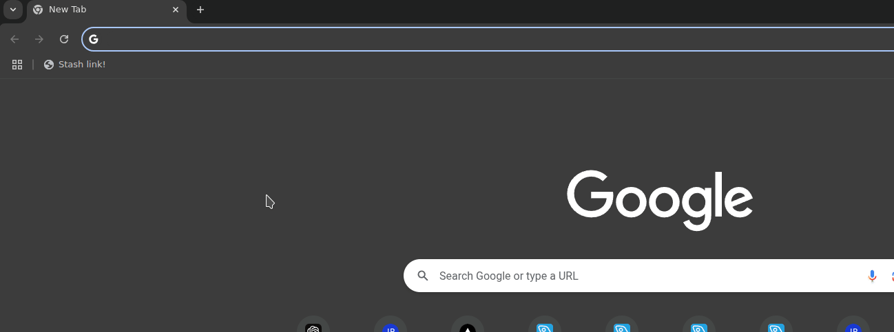

# 02. Adding a Bookmark

> 
1. **Click the Add Button**  
   - Click the **Add** button on the top toolbar to navigate to the **Add Bookmarks** page.

2. **Enter Bookmark Details**  
   - **URL**: Enter the URL of the link you want to save.  
   - **Title**: Provide a title for the link.  
   - **Description**: Add a longer description for the link (optional).
   > LinkStash will try to fetch the title and descriptionof the link entered if it can. You can press the refresh icon on the right of the URL input to force LinKStash to refetch the URL title and description.

3. **Add Tags**  
   - You can add tags to categorize the link:  
     - Start typing a tag name.  
     - The system will autocomplete existing tags.  
     - Use the **Down Arrow** key to highlight the suggested tag and press **Enter** to select it.
     - You can also click on the suggested tag to select it
     - To create a new tag, type it manually and press **Enter**.  

4. **Manage Tags**  
   - Added tags appear as **chips** under the **Tags** section.  
   - To remove a tag, click the **X** on the tag chip.

5. **Save the Bookmark**  
   - Press the **Add Bookmark** button to save the link and return to the **Bookmark List**.

---

## **Adding Bookmarks via Bookmarklet**  
1. **Install the Bookmarklet**  
   - Go to the **Settings** page.  
   - Under the **Bookmarklet** section, drag the bookmarklet to your **Bookmarks Toolbar**.
   >  
2. **Use the Bookmarklet**  
   - When browsing a page you want to save, click the **Bookmarklet**.  
   - A new window will open, allowing you to save the link.  
   - After saving, the window will close, and you will return to the original page.
   >  