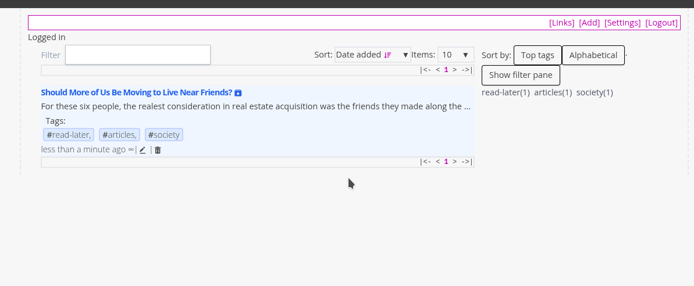
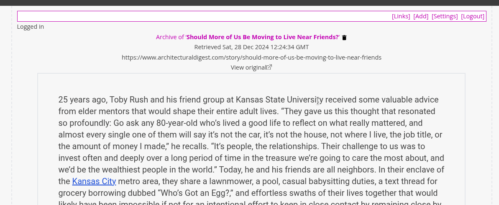

# 04. Archiving

Archiving allows you to create a copy of a website that can be read later offline. This is particularly useful for websites with long articles or content that requires focused time to consume. However, it may not work well for sites that rely heavily on interactivity.

When you archive a website, the formatting is stripped away to present only the core content, much like the 'reader view' feature in modern browsers. Once archived, the content is accessible through LinkStash without requiring an internet connection or relying on the website's continued availability.

**Features of Archiving**
- **Save for Later**: Keep a permanent, offline copy of articles or pages.
- **Simplified Content**: Focus on the text and essential elements without distractions.
- **Resilience**: Access your content even if the original website goes offline.

## How to Archive
On the bookmark card, if there is a `create archive` icon () next to the bookmark title, it means that bookmark doesnt have an archive. Clicking the icon will create an archive of the bookmark.

## Viewing Archived Sites
On the bookmark card, if there is a `view archive` icon () next to the bookmark title, it means that bookmark have an archive already created. Clicking the icon will view the archived bookmark.

## Removing Archives
On the view archive page. Click on the `delete archive` icon () to remove the archive.
