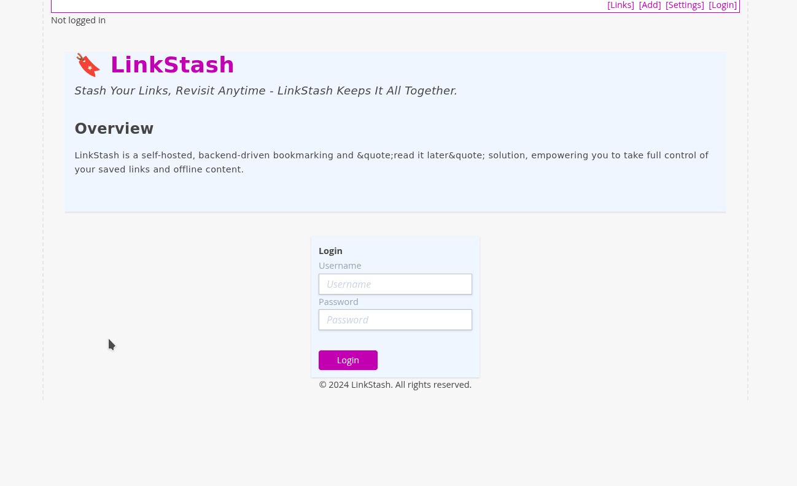

# 01. Installation and Setup
Setting up LinkStash is straightforward, especially with Docker Compose. Follow the steps below to get started quickly. If you encounter any issues, check the troubleshooting section at the end.

## Using docker

### Pre-requisite
- docker
- docker compose

### Quickstart
> It's recommended to start in an empty directory specifically for LinkStash.
1. Create subfolders for data and configs
   ```bash
   mkdir config
   mkdir archive
   ```
2. Download the docker compose file
   ```bash
   wget https://raw.githubusercontent.com/ahmadfarhan1981/linkstash/develop/docker/docker-compose.yaml
   ```
3. Start the docker container   
   ```bash
   docker compose up -d
   ``` 
   > The container will start in daemon mode in the background, use `docker compose down` in this directory to stop it.
4. Open the browser to http://localhost:3000 . You can now login and start using LinkStash.
   >Default credentials:
   > - Username: `admin`
   > - Password: `password`

   

### Configurations

See [configuration](config.md) for more configuration options