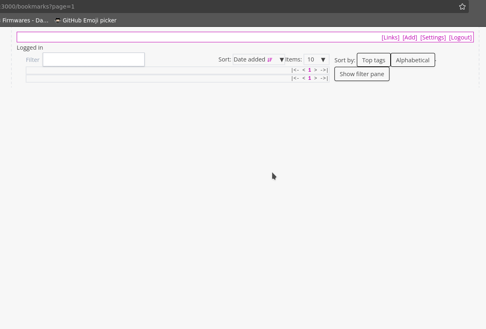

# 03 Settings
The settings page is where you find various admin actions. Here you can find the link to: 
- manage user page
- import page

You can also find the link for the bookmarklet that you drag onto your bookmark bar.

## Manage users page
> User management is currently basic by design, but it's a key area slated for significant improvements and enhancements in the future.

In the manage users page you will see a table with all the users listed. If you do not have the user admin permissions, you can only see your own user here. 
Click 'Actions' on the table row with user that you wish to modify, you will see a dropdow 3 buttons
- Change password
- Set permissions
- Delete user

### Change password
You can change password of the user here. 

### Set permissions
You can set the user permissions here. Right now there you can only set the flag to indicate if the user is a user admin. User admin will be able to modify other users.(change password, set permissions, delete)

### Delete user
Click this to delete the user

### New User
Above the table there is a "Add user" button. Press this to add a new user. A dialog with the details of the new user will pop up. Fill up the detail of the new user you wish to create.

## Import
The import page is where you can import your bookmarks via a netscape bookmar file.
The Netscape bookmark file format is an HTML-based format widely used by browsers for exporting and importing bookmarks due to its compatibility and simplicity.

To import 
- click browse to select the file.
- Select upload file

> Big files may take a while to upload.

### How to export as netscape bookmarks file from various systems:

#### Firefox

1. Click the Library button (or press **Ctrl+Shift+B**).
2. Select **Bookmarks** and then **Show All Bookmarks**.
3. Click on the **Import and Backup** button.
4. Select **Export Bookmarks to HTML...** and save the file.

#### Chrome

1. Click the three-dot menu in the top-right corner and select **Bookmarks**, then **Bookmark Manager**.
2. Click on the three-dot menu in the Bookmark Manager page.
3. Select **Export bookmarks** and save the file.

#### Pinboard

1. Log in to your Pinboard account.
2. Go to the **Settings** page.
3. Under the **Export** section, click on the option to export your bookmarks as an HTML file.

#### Linkding

1. Log in to your Linkding instance.
2. Go to the **Admin panel**.
3. Click on the **Export Bookmarks** option to generate an HTML file in Netscape format.
